##１章　Jekyllとは
[Jekyll](http://jekyllrb.com/ 'jekyll')は、ブログのような静的サイトを構築するためのRuby製ファイルジェネレータです。`Jekyll`はあくまでファイルジェネレータであり、[Rails](http://rubyonrails.org/ 'Ruby on Rails')のように、コマンド一つでサイトの基礎を全部構築してくれるフレームワークではありません。むしろ[Sinatra](http://www.sinatrarb.com/ 'Sinatra')の思想に近く、静的サイト版Sinatraといった趣のツールです。従って、Jekyllを使ってブログサイトを構築しようとする場合、その規約に従って、自分で１つずつファイルを用意していく必要があります。

一方で、Sinatraに[Padrino](http://jp.padrinorb.com/ 'Padrino で素敵なウェブ開発を - Padrino Ruby Web Framework')があるように、Jekyllにもそれをフレームワーク化するツールがあります。[Octopress](http://octopress.org/ 'Octopress')と[Jekyll-Bootstrap](http://jekyllbootstrap.com/ 'Jekyll-Bootstrap')です。

###Octopress
[GitHub Pages](http://pages.github.com/ 'GitHub Pages')その他のホスティングにおいて、最小の労力でブログサイトを構築したいなら、`Octopress`を選ぶべきです。僅か数ステップで設定が完了し記事を書き始めることができるようになります。各種のPluginも簡単に利用できます。Octopressでブログを構築するのなら、次のサイトが参考になります。

> [Big Sky :: githubとjekyllとoctopressで作る簡単でモダンなブログ](http://mattn.kaoriya.net/software/lang/ruby/20111017205717.htm 'githubとjekyllとoctopressで作る簡単でモダンなブログ')

> [Octopressのインストールから運用管理まで - T.I.D.](http://tokkonopapa.github.com/blog/2011/12/30/octopress-on-github-and-bitbucket/ 'Octopressのインストールから運用管理まで')

###Jekyll-Bootstrap

Octopressは簡単な一方で、少しお仕着せのところがあり自由度が少なく感じます。自分の好みにあわせてデザインを変更したり、他の人の作ったデザインを適用したりしたい人は、`Jekyll-Bootstrap`をより気に入ると思います。Octopressよりもデザインテーマのモジュール化が進んでいて、簡単にその切り替えができるように作られています。現状ではまだテーマが少ないですが（http://themes.jekyllbootstrap.com/を参照のこと）、他の人のテーマを参考に、そのいいとこ取りをして自分のテーマを用意することもできます。本家サイトの解説が非常に充実していますので、その使い方は概ねこれで足ります。日本語の解説は次のサイトが参考になります。

> [ruby と jekyll と jekyll-bootstrap で静的サイトを作る - KRAKENBEAL RECORDS](http://krakenbeal.blogspot.jp/2012/05/ruby-jekyll-jekyll-bootstrap.html 'ruby と jekyll と jekyll-bootstrap で静的サイトを作る - KRAKENBEAL RECORDS')

<<<------>>>

##２章　Jekyllを知る
これらのフレームワークは大変便利でJekyllに対する理解がそこそこでも、ブログの運営上大きな支障はありません。しかし、その一方でそのレールから少し外れたことをしようとすると、途端に立ちいかなくなるという問題があります。よくある話です。

本書の目的は、チュートリアルを通してJekyllの概要を理解することです。Jekyllに対する理解が深まれば、上記フレームワークを使った場合でもその運用が楽になるはずです。

チュートリアルでは上記フレームワークを使わずに、Jekyllだけでブログの基礎となるファイル群を１つずつ構築していきます。ここではUnix系OSの使用を前提にしていますので、他OSの場合は適宜読み替えて下さい。

###トップページ
`gem install jekyll`でJekyllを入手したら、ブログを作るディレクトリを用意します。

% mkdir jk


jkディレクトリに移動してトップページを作ります（jkはJekyllの略と理解してください）。JekyllではMarkdownが使えるので、index.mdを作ります。Markdownの文法については以下を参考にしてください。

[blog::2310 » Markdown文法の全訳](http://blog.2310.net/archives/6 'blog::2310 » Markdown文法の全訳')


% cd jk
% echo #Welcome to my JK Home Page! > index.md 


そしてjekyllコマンドを実行します。

% jekyll


エラーメッセージが出ますが無視して`tree`します。

% tree
.
├── _site
│   └── index.md
└── index.md

1 directory, 2 files


`_site`というディレクトリ以下にindex.mdがそのままコピーされてしまいました。つまりhtmlに変換されていません。ルートのindex.mdを直しましょう。先頭に`---`を２本入れます。

    ---
    ---
    #Welcome to my JK Home Page!

もう一度`jekyll`して`tree`します。

% jekyll
% tree
.
├── _site
│   └── index.html
└── index.md

1 directory, 2 files


今度はうまくいきました。Jekyllではこの先頭の`---`で挟まれた領域を`YAML Front-Matter`(YAML前付け)といいます。ここにそのドキュメントの書誌事項を書きます。JekyllはYAML Front-Matter付きのドキュメントをその変換の対象とし、それ以外のドキュメントはそのまま_siteディレクトリ以下にコピーするのです。

では結果をブラウザで確認します。次のようにします。


% jekyll --server

[2012-05-12 10:33:43] regeneration: 1 files changed
[2012-05-12 10:33:43] INFO  WEBrick 1.3.1
[2012-05-12 10:33:43] INFO  ruby 1.9.3 (2012-02-16) [x86_64-darwin10.8.0]
[2012-05-12 10:33:43] INFO  WEBrick::HTTPServer#start: pid=5476 port=4000


4000番ポートでWEBrickが立ち上がりました。http://localhost:4000を開きます。

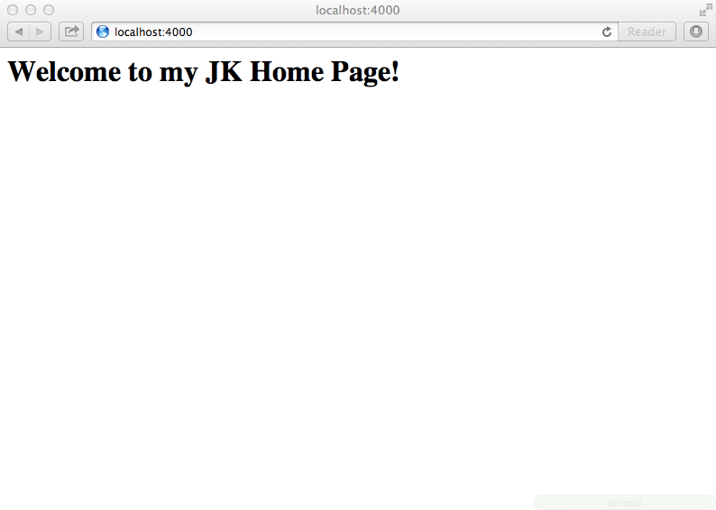
 

 

うまくいきました。

###レイアウト
さて、ブラウザでview sourceなどして、ちょっとこのソースを確認してみます。


<h1 id='welcome_to_my_jk_home_page'>Welcome to my JK Home Page!</h1>


当然ながらHTMLによる構造化レイアウトができていません。早速用意します。

まずはルートに`_layouts`ディレクトリを作ります。layoutファイルをlayout.htmlとしてここに配置します。

% mkdir _layouts
% touch _layouts/layout.html


layout.htmlをエディタで開いて、次のような内容にします。

<!DOCTYPE html>
<head>
  <meta http-equiv="Content-type" content="text/html; charset=utf-8">
  <title>{{ "{{ page.title"}} }}</title>
</head>
<body>
  {{ "{{ content"}} }}
  
- rendered with layout template -

</body>

html内の`{{ "{{ "}} }}`はLiquidテンプレートによる埋め込み指定です。Jekyllでは[Liquid](https://github.com/Shopify/liquid 'Shopify/liquid')というテンプレートエンジンが使えます。titleでは`page.title`により対象ページのタイトルを、bodyでは`content`により対象ページのコンテンツを埋め込むように指定しています。ここではこのlayoutが読み込まれたことを分かるようにするために、**rendered with layout template**という文字を入れました。

再度サーバーを起動して変化を見ます。ここでは`--auto`オプションを付けて起動してみます。

% jekyll --server --auto


ブラウザで確認します。

 

残念ながら変化がありません。

これはindex.mdでどのテンプレートを使うかをちゃんと指定していないからです。ここでYAML Front-Matterの出番です。`index.md`を次のように直します。

    ---
    layout: layout
    title: Oh! My JK
    ---
    #Welcome to my JK Home Page!

ここでは同時にタイトルもセットしました。サーバーはそのままにブラウザをリロードします。

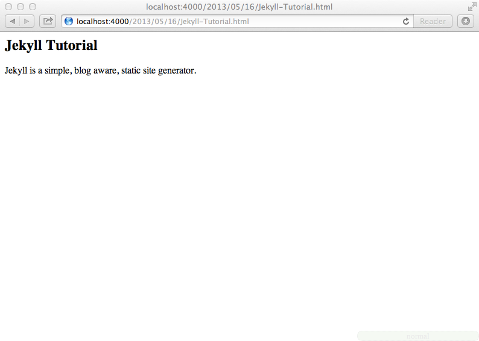

 

今度はうまくいきました。`--auto`オブション指定により、変更が直ちに反映されました。ソースも見てみます。


<!DOCTYPE html>
<head>
  <meta http-equiv="Content-type" content="text/html; charset=utf-8">
  <title>Oh! My JK</title>
</head>
<body>
  <h1 id='welcome_to_my_jk_home_page'>Welcome to my JK Home Page!</h1>
  
- rendered with layout template -

</body>

いいですね。

<<<------>>>

##３章　記事の作成
さてトップページができたので、記事を書きます。Jekyllでは記事のことを**Post**と呼びます。ルートに`_posts`ディレクトリを作成し、次のようなファイル名で記事ファイルを作ります。サーバーはそのままに別のターミナルを立ち上げて、以下を実行します。

% mkdir _posts
% touch _posts/2012-05-01-Jekyll-Tutorial.md


エディタで次のようにMarkdownで記事を書きます。Front-Matterを忘れずに。
    ---
    ---
    ##Jekyll Tutorial
    Jekyll is a simple, blog aware, static site generator.

`jekyll`コマンドを実行してから`tree`します。

% jekyll
% tree
.
├── _layouts
│   └── layout.html
├── _posts
│   └── 2012-05-01-Jekyll-Tutorial.md
├── _site
│   ├── 2012
│   │   └── 05
│   │       └── 01
│   │           └── Jekyll-Tutorial.html
│   └── index.html
└── index.md

6 directories, 5 files


`_site`ディレクトリ以下に`/2012/05/01/Jekyll-Tutorial.html`というファイルが生成されたのが分かります。つまり_post以下に生成したファイルのファイル名のうち、その日付部分はファイルパスとして展開されるのです。ブラウザで`http://localhost:4000/2012/05/01/Jekyll-Tutorial.html`を開いてみましょう。

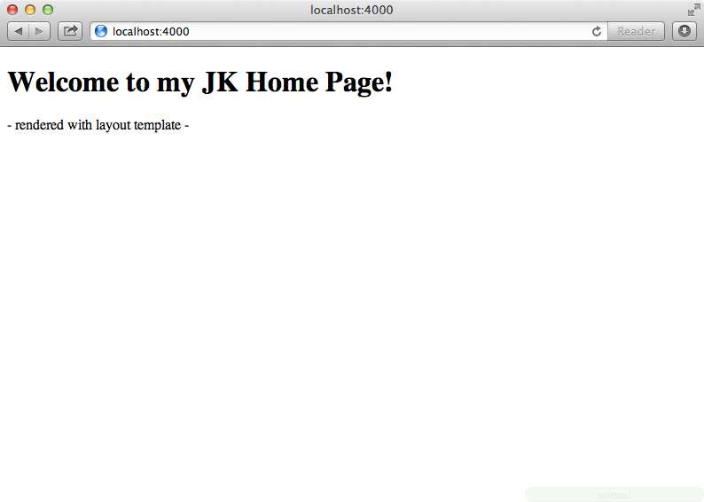

 

うまくいってるようです。

###Postのレイアウト
次に記事にも専用のレイアウトを用意します。_layoutsディレクトリ以下に`post.html`を作って、次のような内容にします。

% touch _layouts/post.html



---
layout: layout
---
<header>
  
{{ "{{ page.date | date_to_string"}} }}

  <h1>{{ "{{ page.title"}} }}</h1>
</header>

  {{ "{{ content"}} }}

<footer>
  
- rendered with post template -

</footer>

Front-Matterでlayout.htmlを読み込むようにします。これによりpost.htmlはlayout.htmlのsub-template
になります。header部分に投稿日とタイトルを表示するようLiquidで指定します。

なお、`{{ "{{ page.date | date_to_string"}} }}`はJekyllで拡張されたLiquidのフィルターという機能を使って、出力の整形を行なっています([Liquid Extensions](https://github.com/mojombo/jekyll/wiki/Liquid-Extensions 'Liquid Extensions · mojombo/jekyll Wiki'))。layout.htmlと同様に、このテンプレートが読み込まれたことを見るために**rendered with post template**を追加しておきます。

そして記事側(/2012-05-01-Jekyll-Tutorial.md)でこのテンプレートを読めるように、そのFront-Matterを記述します。

    ---
    layout: post
    ---
    ##Jekyll Tutorial
    Jekyll is a simple, blog aware, static site generator.

タイトルはテンプレート側で用意するようにしたので、ここでは消します。

サーバーを再起動して変化を見ます。

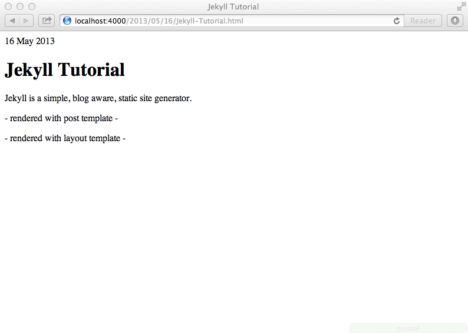

 

ソースも見ます。

<!DOCTYPE html>
<head>
  <meta http-equiv="Content-type" content="text/html; charset=utf-8">
  <title>Jekyll Tutorial</title>
</head>
<body>
  <header>
  
01 May 2012

  <h1>Jekyll Tutorial</h1>
</header>

  
Jekyll is a simple, blog aware, static site generator.

<footer>
  
- rendered with post template -

</footer>
  
- rendered with layout template -

</body>


うまくテンプレートが読み込まれました。

<<<------>>>

##４章　デフォルト設定の変更
前のソースにおいてはファイル名から**Jekyll  tutorial**というタイトルが自動的にセットされていることが分かります。Front-Matterを使って、タイトルとついでに投稿日も変えてみましょう。`_posts/2012-05-01-Jekyll-Tutorial.md`を修正します。

    ---
    layout: post
    title: Jekyllのチュートリアル
    date: 2012-05-02
    ---
    Jekyll is a simple, blog aware, static site generator.

日付を変えたので**http://localhost:4000/2012/05/02/Jekyll-Tutorial.html**にアクセスします。

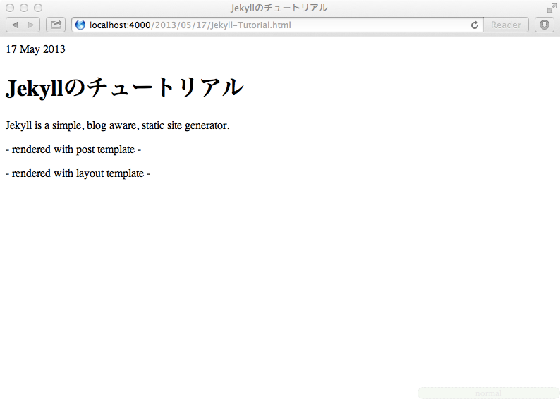

 

投稿日とタイトルが変わりました。つまりYAML Front-Matterの記述によってデフォルトの設定が上書きされました。この場合、元のMarkdownファイルのファイル名における日付と、パスの日付が一致しなくなる点注意が必要です。

###_config.ymlによる設定
個別ページの設定はそのFront-Matterで行うということが分かりました。では全体的な設定はどこでするのでしょうか。それはルートに_config.ymlというファイルを用意して、そこで行います。試しに記事のパス形式を変えてみます。ここではサーバーの再起動が必要です。

    % echo permalink: /:categories/:year-:month-:day/:title > _config.yml
    % jekyll
    % tree
    .
    ├── _config.yml
    ├── _layouts
    │   ├── layout.html
    │   └── post.html
    ├── _posts
    │   └── 2012-05-01-Jekyll-Tutorial.md
    ├── _site
    │   ├── 2012-05-02
    │   │   └── Jekyll-Tutorial
    │   │       └── index.html
    │   └── index.html
    └── index.md
    
    5 directories, 7 files

`_site`ディレクトリを見てわかるように、記事のパスが変わりました。

<<<------>>>

##５章　CSSによるスタイル設定
さて、そろそろCSSによるスタイル設定をします。説明の最初でYAML Front-Matterを含まないファイルはそのまま_siteディレクトリにコピーされると説明しましたが、CSSファイルはそのようにして配置されるファイルの一つです。ここではassets/cssというディレクトリをルートに作って、単純なCSS定義をした`style.css`というファイルを用意します。


% mkdir -p assets/css
% touch assets/css/style.css



body {
  background-color: #dee;
}

h1 {
  color: #11d;
}

h2 {
  color: #161;
}

header {
  border-bottom: 10px solid #a33;
}

footer {
  background-color: #a33;
  color: #fff;
}


`_layouts/layout.html`でstyle.cssを読み込むようにします。

<!DOCTYPE html>
<head>
  <meta http-equiv="Content-type" content="text/html; charset=utf-8">
  <title>{{ "{{ page.title"}} }}</title>
  <link rel="stylesheet" href="/assets/css/style.css" type="text/css"> //ここを追加
</head>
<body>
  {{ "{{ content"}} }}
  
- rendered with layout template -

</body>


ブラウザで見てみます。まずはトップページ（http://localhost:4000/）にアクセスします。

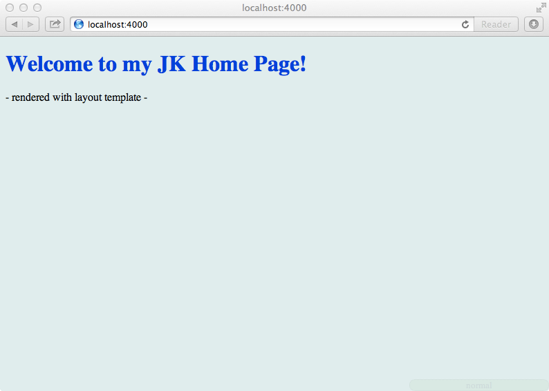

 

次に、記事のページ（http://localhost:4000/2012-05-02/Jekyll-Tutorial/）にもアクセスします。

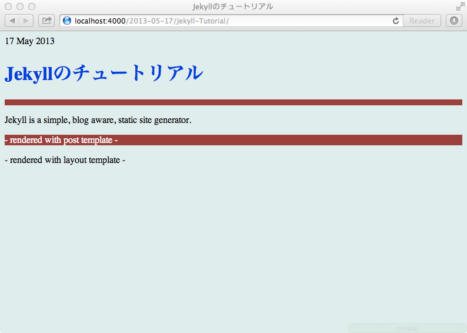

 

うまく適用されているようです。

<<<------>>>

##６章　グローバル変数「site」
Jekyllでは生成されたサイトに対する情報は、グローバル変数siteを通してアクセスできます。siteがどんな情報を持っているか、ちょっと見てみます。`index.md`に戻って、次の一行を追加します。

    ---
    layout: layout
    title: Oh! My JK
    ---
    #Welcome to my JK Home Page!
    
    {{ "{{ site"}} }}  <!-- ここを追加 -->

ブラウザで見てみます。

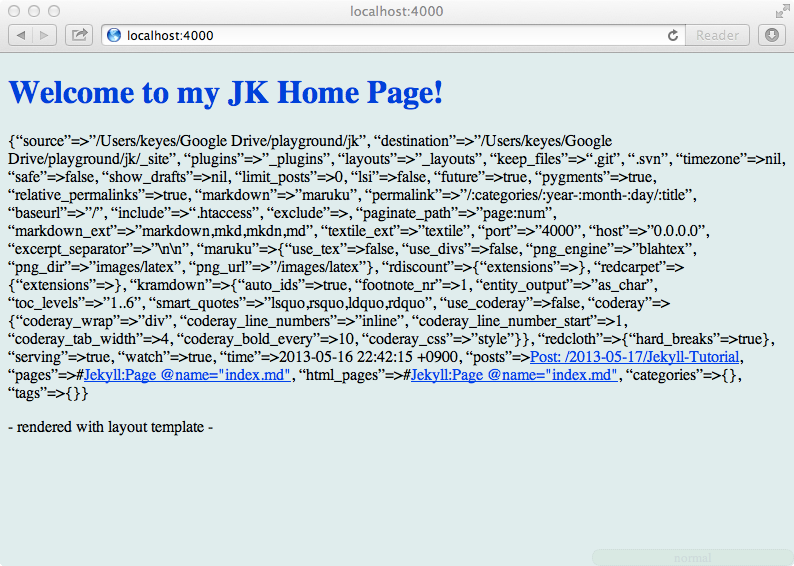
 

`site`で読みだし可能な設定情報が表示されました。情報はHash形式で記録されていますが、これら情報へのアクセスはメソッド呼び出しのようにドットチェーンで行えます。幾つか見てみます。index.mdを書き換えます。

    ---
    layout: layout
    title: Oh! My JK
    ---
    #Welcome to my JK Home Page!
    
    server_port: {{ "{{ site.server_port"}} }}
    
    markdown: {{ "{{ site.markdown"}} }}
    
    permalink: {{ "{{ site.permalink"}} }}
    
    {{ "{{ site"}} }}

アクセスします。

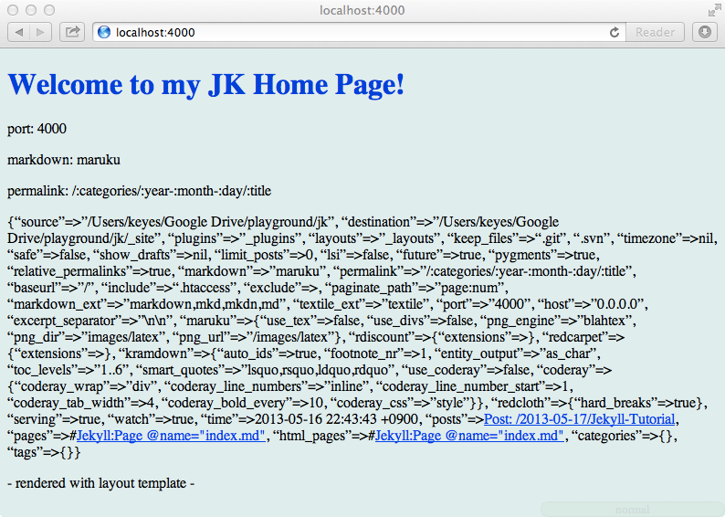
 

.(ドット)でアクセスできました。このうちpermalinkは\_config.ymlでセットしたデータでした。_config.ymlに別の設定を追加して読み出せるか試してみます。


permalink: /:categories/:year-:month-:day/:title
author:
  name: Charlie
  email: charlie@gmail.com

markdown: rdiscount


Markdownにrdiscountを使うように設定したので、`gem install rdiscount`する必要があるかも知れません。

index.mdにauthorに関する事項を追記します。

    ---
    layout: layout
    title: Oh! My JK
    ---
    #Welcome to my JK Home Page!
    
    server_port: {{ "{{ site.server_port"}} }}
    
    markdown: {{ "{{ site.markdown"}} }}
    
    permalink: {{ "{{ site.permalink"}} }}
    
    {{ "{{ site"}} }}
    
    **Copyright © {{ "{{ site.author.name"}} }} 2012 All rights reserved. Please contact to {{ "{{ site.author.email"}} }}.**

サーバーを再起動してからアクセスします。

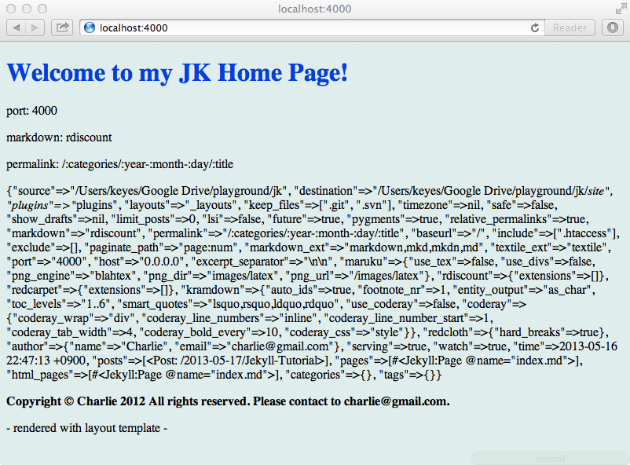
 

Copyrightの注意書きでnameとemailのメソッドチェーンが出来ています。

<<<------>>>

##７章　Liquid制御構文
変数**site**からは`posts`を介してPostに関する情報にもアクセスできます。Liquidテンプレートでは**if**, **case**, **for**などの制御構文が使えるので、これを使って各Postの内容を読みだしてみます。

その前に記事をもう一つ増やしておきます。


% touch _posts/2012-05-03-Ruby-is-Great.md


エディタで記事を書きます。

    ---
    layout: post
    title: Rubyは最高
    tags: [ruby, language]
    ---
    ##Rubyとは
    Rubyは、手軽なオブジェクト指向プログラミングを実現するための種々の機能を持つオブジェクト指向スクリプト言語です。

そしてindex.mdを次のようにします。

    ---
    layout: layout
    title: Oh! My JK
    ---
    #Welcome to my JK Home Page!
    
    <!-- 以下を追加 -->
    <ul>
    {{ "
      <li>
        <a href="{{ '{{ post.url'}} }}">{{ "{{ post.date | date_to_long_string"}} }} : {{ "{{ post.title"}} }}</a>
      </li>
    {{ "
    </ul>
    <!--  -->

    server_port: {{ "{{ site.server_port"}} }}
    
    markdown: {{ "{{ site.markdown"}} }}
    
    permalink: {{ "{{ site.permalink"}} }}
    
    {{ "{{ site"}} }}
    
    **Copyright © {{ "{{ site.author.name"}} }} 2012 All rights reserved. Please contact to {{ "{{ site.author.email"}} }}.**

`for post in site.posts`でpostオブジェクトをイテレートして、**url**, **date**, **title**の各要素を読み出し、リンクを生成します。

ブラウザで見てみます。

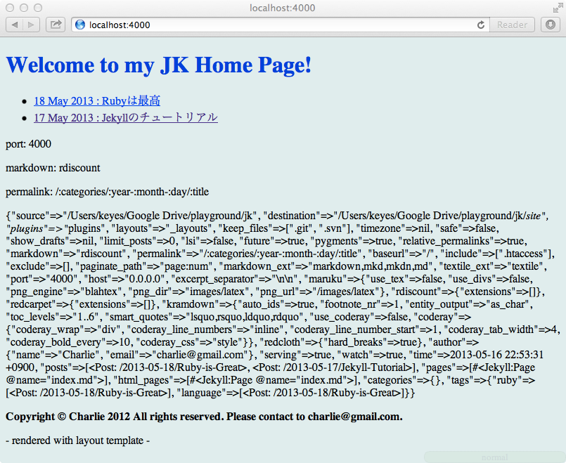
 

クリックしてみます。

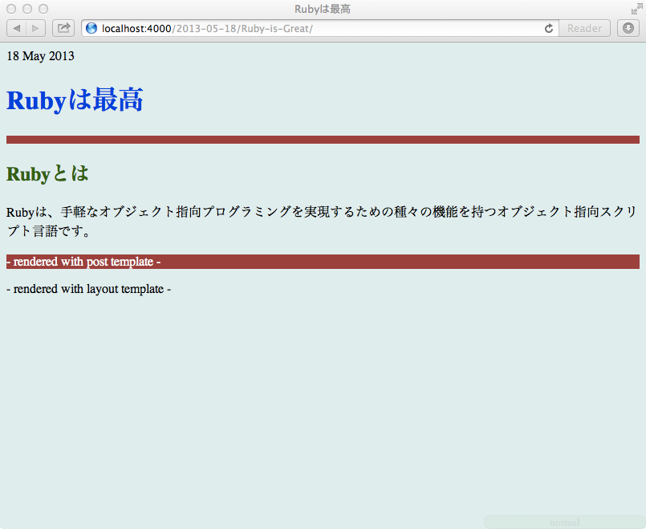
 

いいですね。

<<<------>>>

##８章　グローバル変数「page」
変数siteはサイト全体の情報を持ったオブジェクトでした。一方で、個々のページの情報はグローバル変数pageが持っています。同様に`index.md`で読みだしてみます。

    ---
    layout: layout
    title: Oh! My JK
    ---
    #Welcome to my JK Home Page!
    
    server_port: {{ "{{ site.server_port"}} }}
    
    markdown: {{ "{{ site.markdown"}} }}
    
    permalink: {{ "{{ site.permalink"}} }}
    
    <!-- {{ "{{ site"}} }} -->
    
    **Copyright © {{ "{{ site.author.name"}} }} 2012 All rights reserved. Please contact to {{ "{{ site.author.email"}} }}.**
    
    {{ "{{ page"}} }} <!-- ここを追加 -->

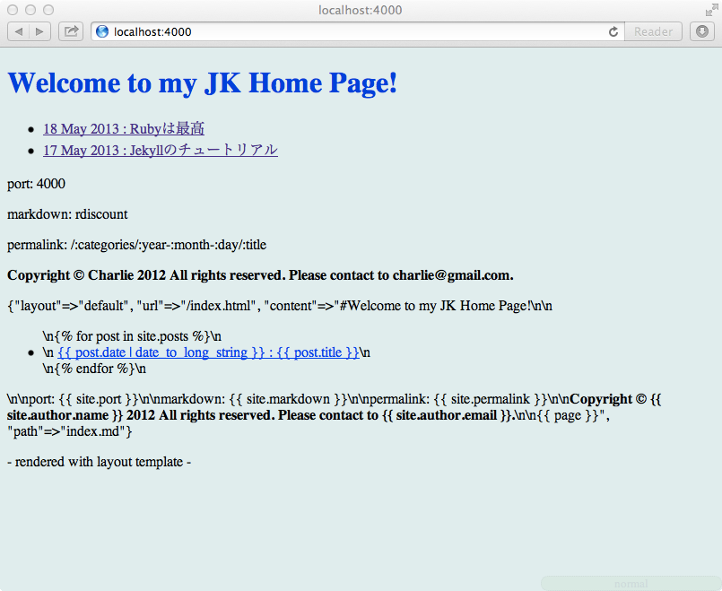
 

トップページにアクセスすると変数`page`は、**layout**, **title**, **url**, **content**の各要素を持っていることが分かります。

同じことを記事のページ(Post)でもしてみます。`_posts/2012-05-03-Ruby-is-Great.md`に追加します。

    ---
    layout: post
    title: Rubyは最高
    tags: [ruby, language]
    ---
    ##Rubyとは
    Rubyは、手軽なオブジェクト指向プログラミングを実現するための種々の機能を持つオブジェクト指向スクリプト言語です。
    
    {{ "{{ page"}} }}

アクセスします。

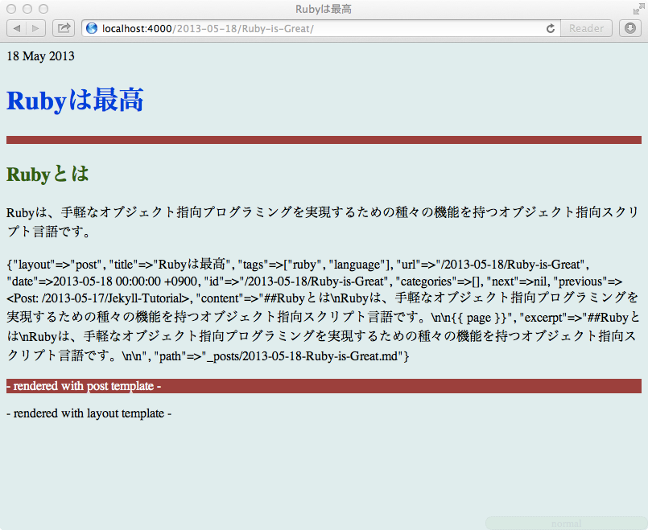
 

Postでは、**layout**, **title**, **date**, **url**, **id**, **categories**, **next**, **previous**, **tags**, **content**の各情報にアクセスできることが分かります。

<<<------>>>

##９章　Liquidによるシンタックスハイライト
さて、次にRubyの記事にプログラムコードを書いてみます。JekyllではLiquidタグを利用することによって、[Pygments](http://pygments.org/ 'Pygments — Python syntax highlighter')によるシンタックスハイライト（Syntax Highlighting）が可能です。前準備が必要です。以下を参考にPygmentsをインストールします。

[Install · mojombo/jekyll Wiki](https://github.com/mojombo/jekyll/wiki/Install 'Install · mojombo/jekyll Wiki')

次のコマンドを実行して`syntax.css`を生成します。

% pygmentize -S default -f html > assets/css/syntax.css


_layouts/layout.htmlでこれを読み込めるようにします。

<!DOCTYPE html>
<head>
  <meta http-equiv="Content-type" content="text/html; charset=utf-8">
  <title>{{ "{{ page.title"}} }}</title>
  <link rel="stylesheet" href="/assets/css/style.css" type="text/css">
  <link rel="stylesheet" href="/assets/css/syntax.css" type="text/css"> //ここを追加
</head>
<body>
  {{ "{{ content"}} }}
  
- rendered with layout template -

</body>


そして、_config.ymlにpygmentsを使う設定を追加します。

    permalink: /:categories/:year-:month-:day/:title
    author:
      name: Charlie
      email: charlie@gmail.com
    
    markdown: rdiscount
    pygments: true

準備ができました。`_posts/2012-05-03-Ruby-is-Great.md`にRubyのコードを書きます。コードは{{ "と{{ "というタグで囲みます。

    ---
    layout: post
    title: Rubyは最高
    tags: [ruby, language]
    ---
    ##Rubyとは
    Rubyは、手軽なオブジェクト指向プログラミングを実現するための種々の機能を持つオブジェクト指向スクリプト言語です。
    
    ##Try Ruby
    {{ "
    class Person
      def initialize(name)
        @name = name
      end
      
      def hello
        "Hello, friend!\nMy name is #{@name}!"
      end
    end
    
    charlie = Person.new('Charlie')
    puts charlie.hello
    
    # >> Hello, friend!
    # >> My name is Charlie!
    {{ "

    {{ "{{ page"}} }}
    
サーバーを再起動してブラウザで確認します。

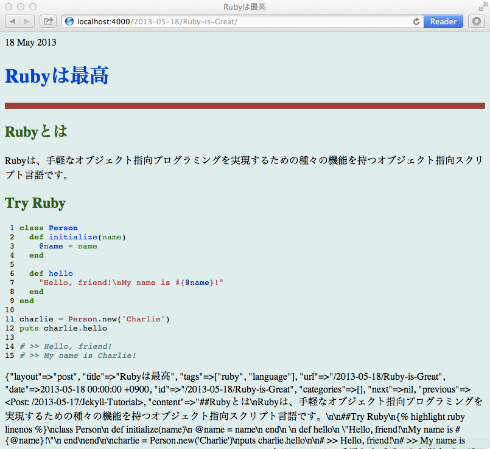
 

あとは好きなようにsyntax.cssを弄るだけです。gistに似せた僕のsytax.cssは[ここ](https://github.com/melborne/melborne.github.com/blob/source/assets/themes/twitter-ext/css/syntax.css 'melborne.github.com/assets/themes/twitter-ext/css/syntax.css at source · melborne/melborne.github.com · GitHub')にありますので、利用してください。

<<<------>>>

##１０章　プラグイン
Jekyllはプラグインによりその変換機能を拡張できます。プラグインには**Generator**, **Converter**, **Tag**という３種類があります。詳細については次を参照してください。

[Jekyll Wiki Pluginsの説明ページを勝手に翻訳しました](http://melborne.github.com/2012/05/09/translation-of-jekyll-plugins/ 'Jekyll Wiki Pluginsの説明ページを勝手に翻訳しました')

シンタックスハイライトに係るプラグインについて前章で説明しましたが、ここではTeXによる数式を貼り付ける[MathJax.rb](https://gist.github.com/834610 'MathJax')というTagプラグインを使ってみます。

`MathJax.rb`はブラウザ上でTeXを表示できるようにする[MathJax.js](http://www.mathjax.org/ 'www.mathjax.org')に対応したプラグインです。

ルートに`_plugins/`ディレクトリを生成し、リンク先から`MathJax.rb`をダウンロードして配置します。

% mkdir _plugins
% mv ~/Downloads/MathJax.rb _plugins/mathjax.rb


_layouts/layout.htmlで`MAthJax.js`を読み込めるようにします。

<!DOCTYPE html>
<head>
  <meta http-equiv="Content-type" content="text/html; charset=utf-8">
  <title>{{ page.title }}</title>
  <link rel="stylesheet" href="/assets/css/style.css" type="text/css">
  <link rel="stylesheet" href="/assets/css/syntax.css" type="text/css">
    <!-- ここを追加 -->
</head>
<body>
  {{ content }}
  
- rendered with layout template -

</body>


準備ができたので、`_posts/2012-05-01-Jekyll-Tutorial.md`に数式を追加します。

    {{ "
    Formular\ from Wikipedia\\
     
    \int_0^3 9x^2 + 2x + 4\, dx = 3x^3 + x^2 + 4x + C \Big\rbrack_0^3 = 102\\
    
    e^{x+iy} = e^x(\cos y + i\sin y)\\
    
    x = \frac{-b \pm \sqrt{b^2 - 4ac}}{2a}
    {{ "

サーバーを再起動してブラウザで確認します。

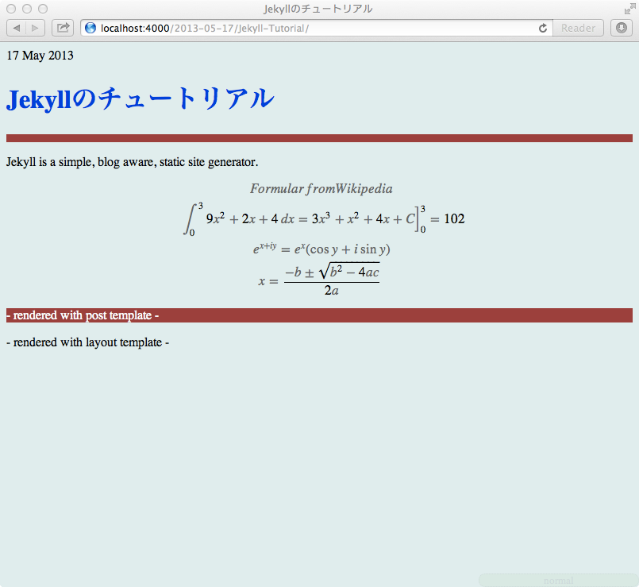
 

きれいな数式が表示されました。

<<<------>>>

##１１章　まとめ
チュートリアルは以上です。

最後にここに記述したJekyllの機能をまとめておきます。

1. `jekyll`コマンドは`_site`ディレクトリ以下に変換ファイルを生成する。

2. YAML Front-Matter付きのファイルはその設定に従い変換され、YAML Front-Matter無しのファイルはそのままコピーされる。

3. ページごとの設定はそのYAML Front-Matterで行い、サイト全体の設定は_config.ymlで行う。

4. 記事ファイルは`:year-:month-:day-:title`のフォーマットで、_postsディレクトリ以下に配置する。

5. レイアウトファイルは_layoutディレクトリ以下に配置する。

6. サイト情報にはグローバル変数`site`でアクセスできる。

7. ページ情報にはグローバル変数`page`でアクセスできる。

8. Liquidテンプレート`{{ "{{"}} }}`または`{{ "`を使ってサイトまたはページオブジェクトの埋め込みができる。

9. `_plugins`ディレクトリ以下にPlugin Scriptを配置することにより、機能拡張が可能である。

<<<------>>>

## 本書について

本書は、ブログ「[hp12c](http://melborne.github.com/ 'hp12c')」における以下の記事の電子書籍版です。

> [30分のチュートリアルでJekyllを理解する](http://melborne.github.com/2012/05/13/first-step-of-jekyll/ '30分のチュートリアルでJekyllを理解する')

メディア向けの調整および誤記の修正を行って電子書籍化しました。EPUBデータの生成には、Rubyで作られた[melborne/maliq](https://github.com/melborne/maliq 'melborne/maliq')を使っています。

## 著者について

**kyoendo(a.k.a melborne)**

Rubyを愛するブログ「[hp12c](http://melborne.github.com/ 'hp12c')」の管理者。東京在住。妻と二人暮らし。

> github: [melborne (kyoendo)](https://github.com/melborne 'melborne (kyoendo)')

> twitter: [kyoendo (merborne) on Twitter](https://twitter.com/merborne 'kyoendo (merborne) on Twitter')

----

2012年12月7日　初版発行

