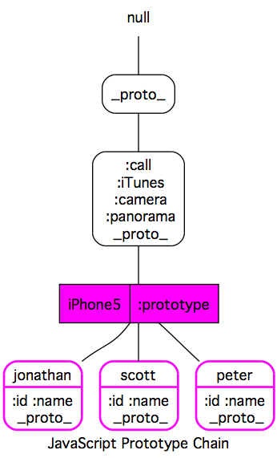
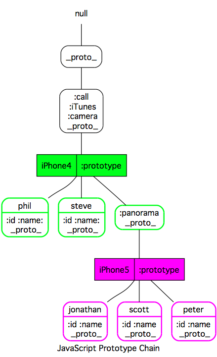
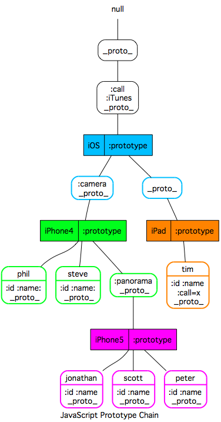
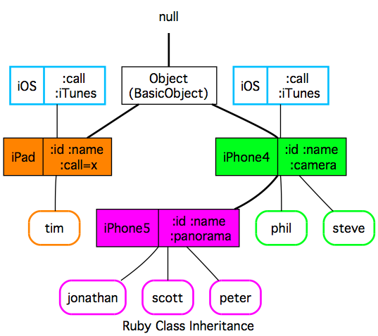

##６章　new 演算子を使う
同種のオブジェクトを多数作るためには差し当たり、関数コンストラクタ + `new`演算子が便利だということがわかりました。もう一度これらを使ってオブジェクトを生成してみます。

諸般の事情によりiPhone5が買えないので（泣）、ここでiPhone5コンストラクタを作って独自ルートからiPhone5をゲットしようと思います。

iPhone5コンストラクタから生成されるiPhone5オブジェクトは固有の`id`を持ちます。それからアップルユーザーが、購入したデバイスに名前をつける習慣にならって（嘘です）、`name`プロパティを用意します。`id`は本来は自動生成されるべきですが、ここでは手入力とします。

function iPhone5 (id, name) {
  this.id = id;
  this.name = name;
};


iPhone5は、電話を掛ける`call`、音楽を聞く`iTunes`、写真を撮る`camera`、およびパノラマを撮る`panorama`の４つの機能を持っているので、これらのプロパティを持ったオブジェクトを、コンストラクタの`prototype`プロパティにセットします。


iPhone5.prototype = {
  call: function(number) {
    return "Calling to " + number + " ...";
  },
  iTunes: function(title, artist) {
    return "Playing: => `" + title + "` of " + artist;
  },
  camera: function() {
    return this.name + " Take a Photo!";
  },
  panorama: function() {
    return this.name + " Take a Panorama Photo!!";
  }
};


さあiPhone5生成器ができました。早速newして、誰よりも早くiPhone5を手に入れます。

var jonathan = new iPhone5(12345, 'Jonathan');
var scott = new iPhone5(12346, 'Scott');

jonathan.id; // 12345
jonathan.name; // 'Jonathan'
jonathan.call('800-692-7753'); // 'Calling to 800-692-7753 ...'
jonathan.iTunes('Imagine', 'John Lennon'); // 'Playing: => `Imagine` of John Lennon'
jonathan.panorama(); // 'Jonathan Take a Panorama Photo!!'

scott.id; // 12346
scott.name; // 'Scott'
scott.call('800-275-2273'); // 'Calling to 800-275-2273 ...'
scott.iTunes('My Hero', 'Foo Fighters'); // 'Playing: => `My Hero` of Foo Fighters'
scott.panorama(); // 'Scott Take a Panorama Photo!!'

いいですね！とりわけ`new`っていうのが、新品ができる感じで。

### オブジェクト関係図
ここで上記コードに係るオブジェクトの関係を図にしたので見てみます。

 

iPhone5コンストラクタ関数から３つのiPhone5オブジェクト、すなわち`Jonathan`、`scott`、`peter`が作成されています。各オブジェクトはそれぞれ固有のidおよびnameプロパティを持っています。iPhone5コンストラクタの`prototype`プロパティには、別のオブジェクト（プロトタイプオブジェクト）がセットされています。プロトタイプオブジェクトは、`call`、 `iTunes`、 `camera`、 `panorama`の各プロパティを持っています。

今、jonathanオブジェクトで`call`プロパティが呼ばれると、Jonathanオブジェクト自身はそれを持っていないので、iPhone5の`prototype`プロパティにセットされたプロトタイプオブジェクトの`call`が参照され、その結果が返されます。つまり、iPhone5コンストラクタは、Jonathanオブジェクトとプロトタイプオブジェクトとを繋ぐ導管の役割をしているのです。

<<<------>>>

##７章　継承

さて、Apple社内でも同種の方法でiPhone5を生産していると予想されますが、仮に僕がSteve JobsもといTim Cookだとしたら、上記コードには口を挟まざるを得ません。

なぜなら、iPhone5の生産においてAppleの過去の資産を全く活用していないからです。Apple社には当然にiPhone4を生産した次のようなコードが残っているはずです。


function iPhone4 (id, name) {
  this.id = id;
  this.name = name;
};

iPhone4.prototype = {
  call: function(number) {
    return "Calling to " + number + " ...";
  },
  iTunes: function(title, artist) {
    return "Playing: => `" + title + "` of " + artist;
  },
  camera: function() {
    return this.name + " Take a Photo!";
  }
};

var phil = new iPhone4(10101, 'Phil');

phil.id; // 10101
phil.name; // 'Phil'
phil.call('408-974-5050'); // 'Calling to 408-974-5050 ...'
phil.iTunes('Valentine', 'Fiona Apple'); // 'Playing: => `Valentine` of Fiona Apple'
phil.camera(); // 'Phil Take a Photo!'

iPhone5は基本的にiPhone4に`panorama`機能を付加しただけのものですから（冗談です!）、これを活用しない手はありません。

iPhone5コンストラクタをこの資産を継承した形に書き換えます。


function iPhone5 (id, name) {
  this.id = id;
  this.name = name;
};

iPhone5.prototype = new iPhone4;
iPhone5.prototype.panorama = function() {
  return this.name + " Take a Panorama Photo!!";
};


`iPhone5.prototype = new iPhone4`としている点がポイントです。つまりiPhone5のprototypeプロパティに、iPhone4コンストラクタから生成されるオブジェクトをそのプロトタイプオブジェクトとしてセットしています。そしてそのプロトタイプオブジェクトに、iPhone5の独自機能である`panorama`を追加しました。

さあもう一度、iPhone5オブジェクトを作ってみます。

var jonathan = new iPhone5(12345, 'Jonathan');
var scott = new iPhone5(12346, 'Scott');

jonathan.id; // 12345
jonathan.name; // 'Jonathan'
jonathan.call('800-692-7753'); // 'Calling to 800-692-7753 ...'
jonathan.iTunes('Imagine', 'John Lennon'); // 'Playing: => `Imagine` of John Lennon'
jonathan.panorama(); // 'Jonathan Take a Panorama Photo!!'

scott.id; // 12346
scott.name; // 'Scott'
scott.call('800-275-2273'); // 'Calling to 800-275-2273 ...'
scott.iTunes('My Hero', 'Foo Fighters'); // 'Playing: => `My Hero` of Foo Fighters'
scott.panorama(); // 'Scott Take a Panorama Photo!!'

うまくいったようですね。

### オブジェクト関係図
さて、先の例と同様に新たなiPhone5生産システムにおけるオブジェクトの関係図も見てみます。

 

iPhone5コンストラクタの`prototype`プロパティにはiPhone4コンストラクタで作ったオブジェクトがセットされています。このオブジェクトはあとで追加した`panorama`プロパティを持っています。

今、jonathanオブジェクトで`call`プロパティが呼ばれると、Jonathanオブジェクト自身はそれを持っていないので、iPhone5の`prototype`プロパティにセットされたプロトタイプオブジェクトのプロパティを参照します。ところが、このオブジェクトも`call`プロパティを持っていないので、iPhone4の`prototype`プロパティにセットされたオブジェクトを参照します。そしてこのオブジェクトにおける`call`が参照され、その結果が返されることになります。つまり、iPhone5およびiPhone4コンストラクタは、プロトタイプチェーンを形成する導管の役割をしています。

<<<------>>>

##８章　更に継承
僕自身は上記生産システムに不満はありませんが、超効率主義のあなたは納得しないでしょうね。

あなた「iPadはどうなってんのよ。別に作れってか」

折角ここまで来たので、ご要望にお答えしまして上記生産システムにiPadの生産ラインも載せることにします。iPhoneとiPadのコアはご存知iOSですから、これをベースにしてiPadコンストラクタのラインも追加します。


function iOS () { };

iOS.prototype = {
  call: function(number) {
    return "Calling to " + number + " ...";
  },
  iTunes: function(title, artist) {
    return "Playing: => `" + title + "` of " + artist;
  }
};

function iPhone4 (id, name) {
  this.id = id;
  this.name = name;
};

iPhone4.prototype = new iOS;
iPhone4.prototype.camera = function() {
  return this.name + " Take a Photo!"
};

function iPhone5 (id, name) {
  this.id = id;
  this.name = name;
};

iPhone5.prototype = new iPhone4;
iPhone5.prototype.panorama = function() {
  return this.name + " Take a Panorama Photo!!";
};

function iPad (id, name) {
  this.id = id;
  this.name = name;
  this.call = function() { return 'not implemented yet'};
};

iPad.prototype = new iOS;

このコードのポイントは、iOSコンストラクタで生成したオブジェクトをiPhone4の`prototype`プロパティと、iPadの`prototype`プロパティにセットしている点です。またiOSコンストラクタの`prototype`プロパティにセットしたオブジェクトは、`call`と`iTunes`プロパティを持っていますが、iPadコンストラクタでは同名の`call`プロパティを定義してこれを無効化しています。

これでiPadも同時に手に入れることができます。iPhone5とiPadを共にゲットしましょう。

var jonathan = new iPhone5(12345, 'Jonathan');
var scott = new iPhone5(12346, 'Scott');

jonathan.id; // 12345
jonathan.name; // 'Jonathan'
jonathan.call('800-692-7753'); // 'Calling to 800-692-7753 ...'
jonathan.iTunes('Imagine', 'John Lennon'); // 'Playing: => `Imagine` of John Lennon'
jonathan.panorama(); // 'Jonathan Take a Panorama Photo!!'

scott.id; // 12346
scott.name; // 'Scott'
scott.call('800-275-2273'); // 'Calling to 800-275-2273 ...'
scott.iTunes('My Hero', 'Foo Fighters'); // 'Playing: => `My Hero` of Foo Fighters'
scott.panorama(); // 'Scott Take a Panorama Photo!!'

var tim = new iPad(8765, 'Tim');

tim.id; // 8765
tim.name; // 'Tim'
tim.iTunes('Black Hourse And The Cherry Tree', 'KT Tunstall'); // 'Playing: => `Black Hourse And The Cherry Tree` of KT Tunstall'
tim.call('800-694-7466'); // 'not implemented yet'

いいですね！

### オブジェクト関係図
新たなiPhone5およびiPad生産システムにおけるオブジェクトの関係図を見てみます。

 

iPhone4コンストラクタの`prototype`プロパティにセットしたオブジェクトには`camera`プロパティがセットされる一方で、iPadコンストラクタの`prototype`プロパティにセットしたオブジェクトには対応プロパティは無いので、このコンストラクタで生成されるiPadにはカメラ機能はないということになります。

また、iPadコンストラクタで生成されるiPadオブジェクトは、`call`プロパティを持ちます（このcallは'not implemented yet'を返します）。このためiPadオブジェクトから`call`プロパティを呼ぶと、iOSコンストラクタのprototypeプロパティにおける`call`プロパティではなくiPadオブジェクトに実装された`call`プロパティが呼ばれることになります。

以上のようにして、私は誰よりも早くiPhone5を手に入れたのでした^ ^;

JavaScriptでは異なる実装による複数の継承が実現できるようですが、ここではnew演算子を使った最も一般的な方法による継承を説明してみました。

<<<------>>>

##９章　Rubyにおける継承

対比のためRubyにおける対応コードを貼っておきます。Rubyにはクラスと似たしかしインスタンスを生成しないモジュールというエンティティがあります。IOSはこれを使って実装し、IPhone4クラスおよびIPadクラスにincludeすることで、その機能を各クラスに付与するようにしています。



### オブジェクト関係図
上記コードに対応する図は次のようになります。

 

Rubyではオブジェクトに対するアクセスはすべてメソッド呼び出しで、基本的にその実体はクラスが保持しています。各オブジェクトはその状態情報（ここではname, id）だけを保持しています。

ここでは詳しい説明は割愛しますが、JavaScriptにおける図と対比して頂けると、２つの言語におけるオブジェクト指向の実現方法の違いが見えてくるかもしれません。

サンプルコードは以下においておきます。

[iPhone5 constructor for describing JavaScript prototype chain — Gist](https://gist.github.com/3727490 'iPhone5 constructor for describing JavaScript prototype chain — Gist')

