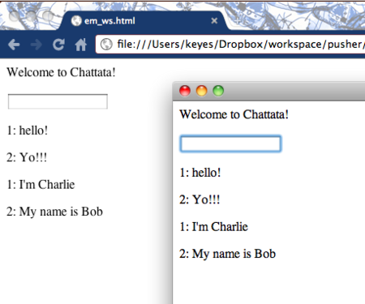

##はじめに

世の中は並列化花ざかりです。人間はシングルタスクのままなのに、プログラミングするときはマルチタスクが要求されるなんて、世知辛い世の中になったものですね。

しかし、情報革命は始まったばかりなので、愚痴ってばかりもいられません。自分がその波にうまく乗れないとしても、うまく乗ってる人の様を間近で見てみたいと思いますよね。

本書では、Rubyのfork、Thread、Reactor、EventMachine、WebSocketなどの並列化について、チュートリアルを通して順に学んでいきます。

<<<------>>>

##１章　REPL

irbはRubyにおける対話型の実行環境です。これは一般にはREPLと呼ばれています。REPLはユーザの入力を読み取り(Read)、評価し(Eval)、出力する(Print) 処理を、繰り返します(Loop)。

irbのコードは5000行にものぼるそうですが、その核心は次のように一行で書けます。

 loop{ puts eval gets }

getsでユーザ入力を読み取り、evalで評価し、putsで出力する処理を、loopで繰り返す。これでは、GEPLですけどね :)

このコードを保存して(gepl.rb)、実行してみましょう。

$ ruby gepl.rb
%w(ruby lisp haskell).map(&:upcase)
RUBY
LISP
HASKELL       
"hello, repl!".gsub('r','g')
hello, gepl!  

ちゃんと動いているようです。`Ctrl+C`で終了します。

通常loopは無限ループを生成しますが、先のコードではgetsのところで処理が止まり、ユーザからの入力を待ち受けるようになります。ここがポイントです。

ちなみにこのコードは、その入出力を明示的にして次のようにも書けます。

loop do
  input = $stdin.gets
  output = eval(input)
  $stdout.puts output
end

デフォルトでグローバル変数$stdinと$stdoutには、標準入力、標準出力がセットされているので、キーボードからの入力が読み取られ、ディスプレイに出力がなされます。

<<<------>>>

##２章　マルチユーザーREPL

REPLは１ユーザに対する対話環境です。でも複数ユーザで使えたらもっとうれしいですよね？どうすればいいでしょうか。

そうです、入出力と評価(eval)を切り離せばいいのです。いわゆるクライアント・サーバー方式です。クライアントからの入力をサーバーに渡して評価し、結果をクライアントに出力するという方式です。

では、早速REPLサーバーを書いてみます。

#repl_server.rb
require "socket"
server = TCPServer.new(60000)
loop do
  client = server.accept   # clientからの接続を待つ
  
  begin
    loop { client.puts eval client.gets }
  rescue
  ensure
    client.close
  end
end

Rubyならこんなにも簡単に書けてしまいます。TCPServer.newでサーバーインスタンスを生成し、acceptメソッドでクライアントからの接続を待ち受けます。クライアントが接続したら、getsでユーザからの入力を評価し結果をユーザに返す。接続したクライアント(これをソケットと呼ぶよ)からgetsし、ソケットにputsしてるところがポイントです。

$stdin $stdoutの参照先をクライアントのソケットに切り替えるやり方にすると、最初のコードとの違いがはっきりするでしょう。

#repl_server.rb
require "socket"
server = TCPServer.new(60000)
loop do
  client = server.accept
  begin
    $stdin, $stdout = client, client
    loop { puts eval gets }
  rescue
  ensure
    client.close
    $stdin = STDIN
    $stdout = STDOUT
  end
end

ensure節ではこれらの後処理をしています。

サーバーを立ち上げてクライアントから接続してみましょう。telnetを使います。

$ telnet localhost 60000
Trying 127.0.0.1...
Connected to localhost.
Escape character is '^]'.
3.times.map { "Hello, friend" }
Hello, friend
Hello, friend
Hello, friend

いい感じですね。`Ctrl+]`に続き`quit`でtelnetの接続を切ります。

<<<------>>>

##３章　並列化REPL　その１
ただ、先のサーバーには大きな問題があります。誰か一人が接続していると他の人が接続できない、つまり複数の人が同時に使えないのです。先のコードで１つの接続がacceptされると、loop内のgetsはその接続先ユーザからの入力を待ち続けることになる。この場合、そのユーザの接続が切れてはじめて、処理はループされacceptで別の接続を待ち受けられるようになるのです。これは大問題です。複数のターミナルから接続して試してみればわかるでしょう。

さあ、ここで並列化の出番です。

Rubyで並列化を実現するにはいくつかの方法があります。どんなやり方があるかちょっと考えて見てください。

###個別接続による並列化
もっとも単純な方法は処理が終わるたびに、ユーザからの接続を毎回切る方法です。前のユーザの接続が切れれば、サーバーは別の接続を待てますからね。まあ、これを並列化と呼ぶのはどうかとも思いますが..

コードは次のような感じになるでしょう。

require "socket"
server = TCPServer.new(60000)
loop do
  client = server.accept
  client.puts eval client.gets
  client.close
end

`eval`したものをクライアントに返したら、そのソケットを閉じる。これによってそのクライアントの接続は切れるので、別のクライアントからの接続を待ち受けられるようになります。

構成がシンプルでいいんですが、ユーザにとってはちょっと面倒ですね。使うたびに接続し直す必要があります。なんかWebサーバーのようですね..

###forkによる並列化
２つ目は複数のプロセスを起動する方法です。Rubyでプロセスを並列化するには`Kernel#fork`を使います。

forkのブロックで囲まれたコードは別プロセスで起動されるので、`loop{}`のところをforkのブロックに投げればよさそうです。やってみましょう。

require "socket"
server = TCPServer.new(60000)
loop do
  client = server.accept
  fork do    # 別プロセスで起動
    begin
      loop { client.puts eval client.gets }
    rescue
    ensure
      client.close
    end
  end
end

acceptでクライアントが接続するとforkで別プロセスが起動されて、その中でgetsの待ち受けがされますが、メインプロセスは外側のループで先頭に戻り、これでacceptで別のクライアントの接続を待てるようになります。

では、複数のtelnetから接続して試してみましょう。

$ telnet localhost 60000
Trying 127.0.0.1...
Connected to localhost.
Escape character is '^]'.
1 + 2
3
---------------------------------------
$ telnet localhost 60000
Trying 127.0.0.1...
Connected to localhost.
Escape character is '^]'.
[2011,10,1].join '-'
2011-10-1

うまくいきました。

念のためこの状況で複数のプロセスが立ってるか確認してみましょう。

$ ps aux | grep repl_server
keyes     1335   0.3  0.1  2448356   1176 s001  R+    3:01PM   0:00.90 ruby repl_server.rb
keyes     1303   0.3  0.0  2448356   1040 s001  S+    2:59PM   0:01.30 ruby repl_server.rb
keyes     1301   0.3  0.2  2448356   3756 s001  R+    2:59PM   0:01.34 ruby repl_server.rb

３つのプロセスが立ってるのがわかります。

ただ、プロセスは個々に独立したメモリ空間を専有するので、接続ユーザ数が多くなるとちょっと心配です。またチャットサーバーのようにユーザ間での情報のやり取りが必要な場合、プロセス間で通信させる必要があるので、そんなときはちょっと厄介そうですね。

###Threadによる並列化
３つ目はスレッドを使う方法です。スレッドは１つのプロセス内で処理を並走させる仕組みです。並走する処理は同じプロセス内にあるから、その間でのデータ共有が容易という利点があります。

では、Threadクラスを使ったサーバーを書いてみます。

require "socket"
server = TCPServer.new(60000)
loop do
  client = server.accept
  
  Thread.new(client) do |cl|
    begin
      loop { cl.puts eval cl.gets }
    rescue
    ensure
      cl.close
    end
  end
end

forkをThread.newに変えればいいだけなので簡単ですね。ただスレッドは同じプロセス内で並走するので、acceptしたclientをブロック引数を通して、ちゃんと渡さないと問題が生じます。

同じように複数のtelnetから接続してみます。

Trying 127.0.0.1...
Connected to localhost.
Escape character is '^]'.
[*1..10].select(&:even?)
2
4
6
8
10
-------------------------------
Connected to localhost.
Escape character is '^]'.
Array.ancestors
Array
Enumerable
Object
Kernel
BasicObject
-------------------------------
$ ps aux |grep repl_server
keyes     1712   0.3  0.2  2451964   3808 s001  S+    7:03PM   0:00.24 ruby repl_server.rb

プロセスは１つのままということが確認できました。

前でスレッドがマルチプロセスよりもデータ共有が容易であると書いたので、そのサンプルも書いてみます。サーバーからの出力を接続しているすべてのクライアントに出力する例です。

require "socket"
server = TCPServer.new(60000)
clients = []   # 接続クライアントの管理用配列
loop do
  client = server.accept
  clients << client  # 接続クライアントを登録
  
  Thread.new(client) do |cl|
    begin
      loop do
        output = eval cl.gets
        clients.each { |c| c.puts output }  # 結果を全クライアントに配信
      end
    rescue
    ensure
      cl.close
      clients.delete(cl) # 切断したクライアントを管理対象外に
    end
  end
end

接続クライアント管理用の配列を用意して、結果を全員にブロードキャストすればいいですね。簡単です。

ただ、スレッドモデルはスレッド間で共有するデータを書き換えるような場合の取り扱いがちょっと厄介です。加えて、やはり各スレッドごとにいつ来るかわからないデータを待っている、というのが無駄といえば無駄に感じられますね。

<<<------>>>

##４章　並列化REPL　その２

###Reactorパターンによる並列化
４つ目はReactorパターンを使って並列化する方法です。Reactorパターンというのは簡単に言うと、一箇所でいろいろなイベントを待ち受けて、イベントが来たらこれに反応(リアクト)して、その種類に応じた処理を実行するモデルのことです。RubyでReactorパターンを実現するには、IO.selectメソッド(またはKernel#select)を使います。

早速、Reactor版REPLサーバーを書いてみます。REPLサーバーにおけるイベントにはサーバーに対するものつまりクライアントの接続と、クライアントに対するものつまりソケットへのデータ入力があります。これらをsocketsという配列で管理しましょう。

require "socket"
server = TCPServer.new(60000)
sockets = [server]
loop do
  r_sockets = IO.select(sockets)[0] # すべてのイベントを待ち受ける
  r_sockets.each do |socket|
    case socket
    when TCPServer     # サーバーに対するクライアントの接続があったとき
      client = socket.accept
      sockets << client
    when TCPSocket     # クライアントに対するデータ入力があったとき
      unless socket.eof?
        socket.puts eval socket.gets
      else
        socket.close
        sockets.delete(socket)
      end
    end
  end
end

IO.selectは登録したソケットに対する入力／出力／例外のイベントを待ち受け、そのイベントが発生したソケットを返しますが、返り値はイベント別のソケットの配列になっています。ここでは入力イベントだけに関心があるから、配列の第一要素のみ取り出しています。

そしてcase式でイベントのあったソケットの種類に応じて処理を切り分けています。つまりサーバーがクライアントからの接続を受けたときは、TCPServerの節に入ってsockets配列に接続のあったクライアントが登録され、ループでselectに戻って次のイベントを待ちます。最初のクライアントの接続時には、sockets配列にはserverしか登録されていないので、処理は必ずここに来ることになります。

一方、クライアントにデータの入力があったときは、TCPSocketの節に入って入力データの処理をします。入力データがあるときはそれを評価し結果を返し、無いときはソケットを閉じてその接続を解放します。そしてループでまたselectに戻って次のイベントを待ちます。

Reactorパターンでは、すべてのクライアントの接続は維持されたままなのに、処理が並走しないつまり単一プロセス単一スレッドで、複数クライアントからの要求に応じることができる、という点がユニークです。このモデルなら処理が並走することはないので、共有データを書き換えるようなことも簡単にできますね。

###EventMachineによる並列化
ただ、when式でのソケットの切り分け処理が面倒といえば面倒です。でも安心してください。`EventMachine`というライブラリを使えば、これが驚異的に簡単にできてしまうのです。

require "eventmachine"
EM.run do
  EM.start_server('localhost', 60000) do |c|
    def c.receive_data(data)
      send_data eval(data)
    end
  end
end

EventMachineはRreactorパターンによる、イベント駆動型のI/Oインタフェースを提供するライブラリです。JavaScriptの`Node.js`のようなものですね。

もうコードを見れば分かると思いますが、EM.runでイベントループが開始されて、クライアントからのデータ入力があると、receive_dataメソッドが呼び出されるので、ここでsend_dataを呼んでevalした入力を返せばいいのです。

EventMachineを使えば、チャットサーバーも簡単に書けてしまいます。

require "eventmachine"
module Chat
  @@channel = EM::Channel.new
  def post_init
    puts "-- someone connected"
    @sid = @@channel.subscribe { |data| send_data ">> #{data}" }
  end

  def receive_data(data)
    @@channel.push data
  end

  def unbind
    puts "-- someone disconnected from the server"
    @@channel.unsubscribe(@sid)
  end
end

EM.run do
  EM.start_server('localhost', 60000, Chat)
end

EMサーバーはクライアントの接続があるたびにその引数でセットしたChatモジュールをインスタンス化して、その監視対象として登録します。各インスタンスのpost_initメソッドはその接続時に、unbindメソッドはその切断時に呼び出され、receive_dataは先の例と同様にデータ受信時に呼び出されます。

データをブロードキャストするにはEM::Channelを使います。subscribeでそのクライアントに対する処理を登録して、pushで呼び出せばいいです。

`gem install eventmachine`して、telnetから試してみてください。

###WebSocket
ここまでくるとWeb上でもこの並列化技術を使いたい、と考えるのが人情です。そう、これこそがWebSocketなのです。

そしてうれしいことに、EventMachineにはそのためのプラグイン`em-websocket`があります。`gem install em-websocket`して使います。サーバー側のコードは次のような感じになります。


require 'em-websocket'
EM.run {
  @channel = EM::Channel.new
  EM::WebSocket.start(:host => "localhost", :port => 60000) do |ws|
    sid = nil
    ws.onopen { sid = @channel.subscribe { |msg| ws.send msg } }
    ws.onmessage { |msg| @channel.push "#{sid}: #{msg}" }
    ws.onclose { @channel.unsubscribe(sid) }
  end
}


EM::WebSocket.startでサーバーインスタンスを立ち上げて、クライアントからの接続を待ち受けます。クライアントからの接続があるとonopenが呼ばれるので、ここでchannelにメッセージをブロードキャストする処理を登録します。クライアントがテキストを送信するとonmessageが呼ばれるので、それをchannelにpushして登録した処理を呼びます。

次にクライアントサイドのコードです。

<html>
  <head>
    
    
  </head>
  <body>
    

    <form>
      <input id="msg" type="text"></input>
    </form>
    

  </body>
</html>

クライアント側では、サーバーに接続するソケットをインスタンス化します。ユーザがテキストを送信すると$("form").submitが呼ばれ、その内容はws.sendでソケットに送り出されます。これによってサーバー側のchannelに登録された処理が呼ばれ、接続されているクライアントにテキストがブロードキャストされるようになります。クライアント側ではこれをonmessageで受けて、テキストをwindow上に表示します。

では試してみましょう。

 

良い感じですね！

WebSocketはHTML5の新しい規格なので対応ブラウザか確認してください。

<<<------>>>

## 謝辞

本書は、ブログ「[hp12c](http://melborne.github.com/ 'hp12c')」における以下の記事の電子書籍版です。

> [irbから学ぶRubyの並列処理 ~ forkからWebSocketまで](http://melborne.github.com/2011/09/29/irb-Ruby-fork-WebSocket/ 'irbから学ぶRubyの並列処理 ~ forkからWebSocketまで')

文体の変更、誤記の修正およびメディア向けの調整を行って電子書籍化しました。EPUBデータの生成には、Rubyで作られた[melborne/maliq](https://github.com/melborne/maliq 'melborne/maliq')を使っています。

## 著者について

**kyoendo(a.k.a melborne)**

Rubyを愛するブログ「[hp12c](http://melborne.github.com/ 'hp12c')」の管理者。東京在住。妻と二人暮らし。

> github: [melborne (kyoendo)](https://github.com/melborne 'melborne (kyoendo)')

> twitter: [kyoendo (merborne) on Twitter](https://twitter.com/merborne 'kyoendo (merborne) on Twitter')

----

2012年12月13日　初版発行

