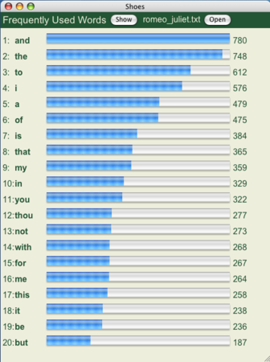


##バージョン22（出力形式の再考）

っと、その前に...

アウトプットのしょぼさに今さらながら気が付いてしまいました。

 wdic = WordDictionary.new(ARGF)
 p wdic.top_by_frequency(20)
#> [["the", 16077], ["of", 9823], ["and", 7482], ["to", 7098], ["in", 4456], ["a", 3841], ["that", 3161], ["was", 3040], ["it", 2919], ["i", 2881], ["her", 2550], ["she", 2313], ["as", 2134], ["you", 2071], ["not", 2057], ["be", 2044], ["is", 2033], ["his", 2009], ["he", 1940], ["for", 1927]]


これが上司に対する報告か何かの類いのものならまず却下です。これをもう少しマシなものにしましょう。

 wdic = WordDictionary.new(ARGF)
 wdic.top_by_frequency(20).each { |word, freq| puts "#{freq}:#{word}" }
#>
 16077:the
 9823:of
 7482:and
 7098:to
 4456:in
 3841:a
 3161:that
 3040:was
 2919:it
 2881:i
 2550:her
 2313:she
 2134:as
 2071:you
 2057:not
 2044:be
 2033:is
 2009:his
 1940:he
 1927:for


これだけでも大分よくなりました。しかし上司はもっと視覚的にアピールするものを好むでしょうね。

<<<------>>>


##バージョン23（pretty_printの定義）

単語の出現数を*の数で視覚化する、pretty_printメソッドを定義しましょう。

 def pretty_print(data)
   max_stars = 60
   max_value = data.max_by { |key, val| val }.slice(1)
   data.each do |word, freq|
     stars = "*" * (max_stars * (freq/max_value.to_f)).ceil
     printf "%5d:%-5s %s\n", freq, word, stars
   end
 end
 
 wdic = WordDictionary.new(ARGF)
 pretty_print wdic.top_by_frequency(20)


出力は次のようになります。

16077:the   ************************************************************
 9823:of    *************************************
 7482:and   ****************************
 7098:to    ***************************
 4456:in    *****************
 3841:a     ***************
 3161:that  ************
 3040:was   ************
 2919:it    ***********
 2881:i     ***********
 2550:her   **********
 2313:she   *********
 2134:as    ********
 2071:you   ********
 2057:not   ********
 2044:be    ********
 2033:is    ********
 2009:his   ********
 1940:he    ********
 1927:for   ********

いい感じですね。

prinftを使って出力をフォーマットしています。フォーマットについては、公式マニュアルの以下の頁が参考になります。

[module function Kernel.#format](http://doc.ruby-lang.org/ja/1.9.3/method/Kernel/m/format.html "module function Kernel.#format")

<<<------>>>


##バージョン24（GUI版）


「おいおい未だにCUIかよ！」

いつか言われると思いました。

だから先回りして、GUI版を用意しておきました。

 

ShoesというRubyのGUIフレームワークで書いています。もちろんWordDictionaryクラスで生成したオブジェクトを使い、Shoesではその描画だけをしています。**Open**で対象ファイルを開き、**Show**でグラフが描画されます。

実装は褒められたものじゃありませんが、これも合せて公開しておきます。実行にはShoesのインストールが必要です。

[gist: 93900 - GitHub](http://gist.github.com/93900)

[Shoes! The easiest little GUI toolkit, for Ruby.](http://shoesrb.com/ "Shoes! The easiest little GUI toolkit, for Ruby.")

