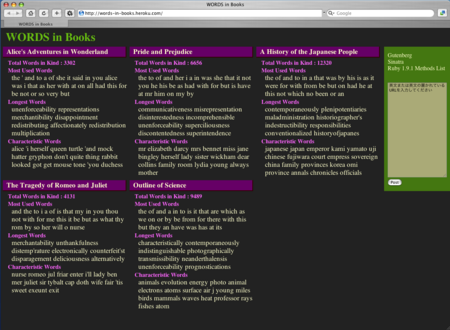


##バージョン28（ユニークワードの抽出）

さてこれらの演算子を使って何かしたいですね...

いいのを思いつきました。

ある小説を元にしたオブジェクトから、基本単語からなるオブジェクトを差し引けば、その小説にユニークな単語が抽出できるかもしれません。

 class WordDictionary

   def select(regexp)
     text =
        @freq_dic.select { |word, freq| word =~ regexp }
                 .select { |word, freq| block_given? ? yield(freq) : freq }
                 .map { |word, freq| "#{word} " * freq }
                 .join(" ")
     WordDictionary.new(text, true)
   end

   def uniq_words(n, *base)
     base.inject(self) { |_self, b| _self - b.select(/./) { |freq| freq >= 10 }  }.top_by_frequency(n)
   end
 end


uniq_wordsは個数nと複数の基本単語オブジェクトbaseを取って、そのオブジェクトに固有のワードトップnを出力します。injectメソッドのブロックの中で先ほど定義した-メソッドを使っています。

ここでselectメソッドを使ってbaseオブジェクトにおける、対象単語をその頻度が10以上のものに限定することで、baseオブジェクトにおけるゴミ(基本単語でないもの)をある程度排除するようにしています。そのためselectメソッドをブロックを取れるように修正しました。

さて、早速「不思議の国のアリス」のユニークなワードを出力してみましょう。

 if $0 == __FILE__
  base = WordDictionary.new('public/base.txt')
  alice = WordDictionary.new('public/alice.txt')
  p alice.uniq_words(40, base)
 end 
 ># Argument has assumed as a text string
 ># Argument has assumed as a text string
 ># [["alice", 403], ["turtle", 59], ["mock", 56], ["hatter", 56], ["gryphon", 55], ["rabbit", 51], ["got", 45], ["mouse", 44], ["duchess", 42], ["tone", 40], ["dormouse", 40], ["cat", 37], ["hare", 31], ["caterpillar", 28], ["jury", 22], ["sort", 20], ["tea", 19], ["soup", 18], ["bill", 17], ["hastily", 16], ["bit", 16], ["doesn", 16], ["didn", 14], ["dinah", 14], ["anxiously", 14], ["baby", 14], ["footman", 14], ["trying", 14], ["cook", 13], ["wouldn", 13]]


なんかいい感じじゃないですか！

なお最後のif $0 == \_\_FILE\_\_ はこのスクリプトを他のスクリプトからrequireしたときにはこの部分が、require先で実行されないようにするための技法です。$0はrubyインタプリタに渡したスクリプト名\_\_FILE\_\_はこのスクリプト名を参照します。

<<<------>>>


##バージョン29（仕上げ）

でも、さっきからうっとうしい文字が一緒に出力されていますね。オブジェクトを内部で再構築するとき文字列を渡すのでそれが原因です。フラグを立ててこれに対処します。

WordDictionaryクラス内部でオブジェクトを生成するときはinner_callにtrueを渡して、"Argument has..."のメッセージがでないようにします。

ついでに最後の仕上げとして、クラスは入力データの名前nameを受け取れるようにし、また総単語種数を出力するsizeメソッドも定義しましょう。

 class WordDictionary
   att_reader :words, :name
   def initialize(input, name="none", inner_call=false)
     input = input_to_string(input, inner_call)
     @name = name
   end
   def select(regexp)
     text = @freq_dic.select { |word, freq| word =~ regexp }.select { |word, freq| block_given? ? yield(freq) : freq }.map { |word, freq| "#{word} " * freq }.join(" ")
     WordDictionary.new(text, @name, true)
   end
   
   def size
     @freq_dic.length
   end
   private
   def input_to_string(input, inner_call)
    case input
    when String
      begin
        File.open(input, "r") { |f| return f.read }
      rescue
        puts "Argument has assumed as a text string" unless inner_call
        input
      end
    end
   end
   def arithmetics(op, other)
     result = (@words.send op, other.words).join(" ")
     WordDictionary.new(result, '', true)
   end
 end


さあこれで完成です！完成したスクリプト全体を眺めてみましょう。

 require "open-uri"
  module Enumerable
    def take_by(nth)
      sort_by { |elem| yield elem }.slice(0...nth)
    end
  end
  
  class WordDictionary
    include Enumerable
    attr_reader :name, :words
 
    def initialize(input, name= 'none', inner_call=false)
      input = input_to_string(input, inner_call)
      @words = input.downcase.scan(/[a-z']+/)
      @freq_dic = @words.inject(Hash.new(0)) { |dic, word| dic[word] += 1 ; dic }
      @name = name
    end
  
    def each
      @freq_dic.each { |elem| yield elem }
    end
  
    def top_by_frequency(nth, &blk)
      take_by_value(nth, lambda { |v| -v }, &blk)
    end
  
    def bottom_by_frequency(nth, &blk)
      take_by_value(nth, lambda { |v| v }, &blk)
    end
  
    def top_by_length(nth, &blk)
      list = take_by_key(nth, lambda { |word| -word.length }, &blk)
      list.map { |word, freq| [word, freq, word.length] }
    end
  
    def select(regexp)
      text = @freq_dic.select { |word, freq| word =~ regexp }.select { |word, freq| block_given? ? yield(freq) : freq }.map { |word, freq| "#{word} " * freq }.join(" ")
      WordDictionary.new(text, @name, true)
    end
 
    def to_s
      @freq_dic.to_s
    end
    
    def size
      @freq_dic.length
    end
    
    def +(other)
      arithmetics(:+, other)
    end
    
    def -(other)
      arithmetics(:-, other)
    end
    
    def &(other)
      arithmetics(:&, other)
    end
    
    def |(other)
      arithmetics(:|, other)
    end
    
    def uniq_words(nth, *base)
      base.inject(self) { |_self, b| _self - b.select(/./) { |freq| freq >= 10 }  }.top_by_frequency(nth)
    end
	
    protected :words 
    private
    def input_to_string(input, inner_call)
     case input
     when /^http/
       begin
         open(input) { |f| return f.read }
       rescue Exception => e
         puts e
         exit
       end
     when String
       begin
         File.open(input, "r") { |f| return f.read }
       rescue
         STDERR.puts "Argument has assumed as a text string" unless inner_call
         input
       end
     when ARGF.class
       input.read
     else
       raise "Wrong argument. ARGF, file or string are acceptable."
     end
    end
   
    def take_by_value(nth, sort_opt, &blk)
      val = lambda { |key, val| val }
      take_by_key_or_val(nth, sort_opt, val, &blk)
    end
  
    def take_by_key(nth, sort_opt, &blk)
      key = lambda { |key, val| key }
      take_by_key_or_val(nth, sort_opt, key, &blk)
    end
  
    def take_by_key_or_val(nth, sort_opt, by)
      @freq_dic.select { |key, val| block_given? ? yield(val) : val }.take_by(nth) { |key, val| sort_opt[by[key, val]] }
    end
    
    def arithmetics(op, other)
      result = (@words.send op, other.words).join(" ")
      WordDictionary.new(result, '', true)
    end
  end
  
  def pretty_print(data)
    max_stars = 60
    max_value = data.max_by { |word, freq| freq }.slice(1)
    data.each do |word, freq|
      stars = "*" * (max_stars * (freq/max_value.to_f)).ceil
      printf "%5d:%-5s %s\n", freq, word, stars
    end
  end
 
 if $0 == __FILE__
  base = WordDictionary.new('public/base.txt')
  alice = WordDictionary.new('public/alice.txt', "Alice's Adventures in Wonderland")
  jp_history = WordDictionary.new('public/japanese_history.txt')
  p alice.uniq_words(40, base)
  p jp_history.uniq_words(40, base)
 end


<<<------>>>

##最後に

英文小説の最頻出ワードを見つける旅はこれで終わりです。長い道のりでした。でもわたしは楽しめました。そして大変勉強になりました。

そう、このチュートリアルは皆様のためにではなく、実は私自身のために書かれたものなのです。Rubyのエキスパートが余裕を持って書いたものではなく、プログラム新人が学び試行錯誤しながら、その知力の限界を引き出して書いたものなのです。

でも一方で、このチュートリアルを役に立ったと言ってくれる人がいつか現れると信じてもいるのです。それがRubyを学びその成果をブログで公開するわたしのエンジンになっているのです。

最後にこのWordDictionaryクラスを使ったWebアプリケーションを構築してみました。これが今回のチュートリアルの一応の成果です。よろしければアクセスしてみてください。

[WORDS in Books](http://wordsinbooks.herokuapp.com/ 'WORDS in Books')

 

機能は次の3つだけです。

1. いくつかの英文小説の特徴、つまりタイトル、総単語種数(Total Words in Kind)、最頻出ワードtop30(Most Used Words)、最ワード長top10(Longest Words)、特徴ワード20(Characteristic Words)を表示します。
1. 小説タイトルをクリックするとその文章の頁に遷移します。
1. 右端の入力欄に英文または英文の置かれたURLを入れることで、その文章の特徴を抽出して表示します。

サイトの構築には、[Sinatra](http://www.sinatrarb.com/)というWebフレームワークと、[heroku](http://heroku.com/)というサービスを使いました。

すべてのスクリプトは以下に公開しています。

> [gist: 93900 - GitHub](http://gist.github.com/93900)

<<<------>>>

## 謝辞

本書は、ブログ「[hp12c](http://melborne.github.io/ 'hp12c')」における以下の記事の電子書籍版です。

> [Rubyチュートリアル ─ 英文小説の最頻出ワードを見つけよう! ─](http://melborne.github.io/2013/04/26/find-most-frequently-words-with-ruby/ "Rubyチュートリアル ─ 英文小説の最頻出ワードを見つけよう! ─")

ブログにおける誤記の修正およびメディア向けの調整を行って電子書籍化しました。EPUBデータの生成には、Rubyで作られた[melborne/maliq](https://github.com/melborne/maliq 'melborne/maliq')を使っています。

## 著者について

**kyoendo(a.k.a melborne)**

Rubyを愛するブログ「[hp12c](http://melborne.github.com/ 'hp12c')」の管理者。東京在住。妻と二人暮らし。

> github: [melborne (kyoendo)](https://github.com/melborne 'melborne (kyoendo)')

> twitter: [kyoendo (merborne) on Twitter](https://twitter.com/merborne 'kyoendo (merborne) on Twitter')

----

2013年4月26日　初版発行
